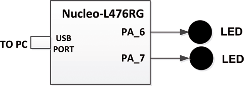

# BinaryCount

Con este proyecto podemos visualizatr el incremento progresivo de 1 Byte con una representacion visual en LEDs. El incremento de produce cada 50 ms.

Diagrama de bloques del proyecto:
 

## Video test

https://github.com/PuertOcho/BinaryCount/assets/57835621/8ac3e5dc-8f83-41b9-af3b-c5b9a6017101
